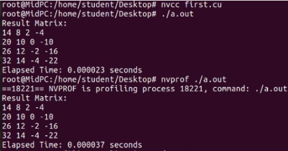

# -PCA-Implement-Matrix-Multiplication-using-CUDA-C.-Find-the-elapsed-time.


## Aim:
To implement Matrix Multiplication using GPU.
## Procedure:
### Step 1 :
Include the required files and library.

### Step 2 :
Declare the block size and the size of elements .

### Step 3 :
Introduce Kernel function to perform matrix multiplication.In the kernal function,decalre the row column size and initialize the sum to be 0,then using for loop calculate the sum.

### Step 4 :
Intoduce a Main function, in the main method declare the required variables and Initialize the matrices 'a' and 'b'.Allocate memory on the device and then copy the input matrices from host to device memory and set the grid and block sizes . Launch the kernel,Copy the result matrix from device to host memory ,Print the result matrix and the elapsed time followed by freeing the device memory.

### Step 5 :
Save the program and execute it .

## Program:
```
Developed by: Saravana Kumar S
Reg No: 212221230088
```

```c
#include <stdio.h>
#include <sys/time.h>
#define SIZE 4
#define BLOCK_SIZE 2

// Kernel function to perform matrix multiplication
__global__ void matrixMultiply(int *a, int *b, int *c, int size)
{
    int row = blockIdx.y * blockDim.y + threadIdx.y;
    int col = blockIdx.x * blockDim.x + threadIdx.x;
    int sum = 0;
    for (int k = 0; k < size; ++k)
    {
        sum += a[row * size + k] * b[k * size + col];
    }
    c[row * size + col] = sum;
}

int main()
{
    int a[SIZE][SIZE], b[SIZE][SIZE], c[SIZE][SIZE];
    int *dev_a, *dev_b, *dev_c;
    int size = SIZE * SIZE * sizeof(int);
    // Initialize matrices 'a' and 'b'
    for (int i = 0; i < SIZE; ++i)
    {
        for (int j = 0; j < SIZE; ++j)
        {
            a[i][j] = i + j;
            b[i][j] = i - j;
        }
    }

    // Allocate memory on the device
    cudaMalloc((void**)&dev_a, size);
    cudaMalloc((void**)&dev_b, size);
    cudaMalloc((void**)&dev_c, size);
    // Copy input matrices from host to device memory
    cudaMemcpy(dev_a, a, size, cudaMemcpyHostToDevice);
    cudaMemcpy(dev_b, b, size, cudaMemcpyHostToDevice);
    // Set grid and block sizes
    dim3 dimGrid(SIZE / BLOCK_SIZE, SIZE / BLOCK_SIZE);
    dim3 dimBlock(BLOCK_SIZE, BLOCK_SIZE);
    // Start timer
    struct timeval start, end;
    gettimeofday(&start, NULL);

    // Launch kernel
    matrixMultiply<<<dimGrid, dimBlock>>>(dev_a, dev_b, dev_c, SIZE);
    // Copy result matrix from device to host memory
    cudaMemcpy(c, dev_c, size, cudaMemcpyDeviceToHost);
    // Stop timer
    gettimeofday(&end, NULL);
    double elapsed_time = (end.tv_sec - start.tv_sec) + (end.tv_usec - start.tv_usec) / 1000000.0;
    // Print the result matrix
    printf("Result Matrix:\n");
    for (int i = 0; i < SIZE; ++i)
    {
        for (int j = 0; j < SIZE; ++j)
        {
            printf("%d ", c[i][j]);
        }
        printf("\n");
    }

    // Print the elapsed time
    printf("Elapsed Time: %.6f seconds\n", elapsed_time);

    // Free device memory
    cudaFree(dev_a);
    cudaFree(dev_b);
    cudaFree(dev_c);
    return 0;
}
```
## Output:


## Result:
The implementation of Matrix Multiplication using GPU is done successfully and the time taken is found to be 0.000037 seconds.